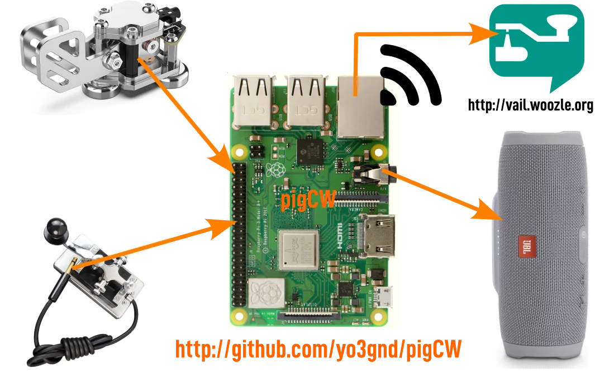

# pigCW

Still experimental. This is a terminal-only client to [Vail](https://vail.woozle.net), for practicing Morse code over the internet.
Connect a straight key or a paddle to the Pi's GPIo and a speaker on its audio output. It becomes a rather direct little Vail terminal - the moment someone sends something on Vail, you will hear it and you can reply directly from your key. It also generates the sidetone on the very same speaker, with care taken for a real-time response.
Based on an idea by [YO3AX](https://github.com/YO3AX): "I'm thinking of a batphone like device, but for CW, directly connected to Vail. It just beeps at you when someone sends and patiently waits for your reply"

The name pigCW is a bad pun between ham and pigpio - the main IO library - often misread as "pig pio".

<p align="center">
  
</p>

But why Vail?

Vail suits this sort of thing unusually well because:
- it has near-instant sidetone. This matters once you start taking keying a bit more seriously
- it allows you to practice with friends without turning on your rig
- the community is excellent. I even got QSL cards for contacts made here
- it has open hardware, built around a cheap little $10 Seeed board
- the hardware is well made, and when operating as a MIDI device, it lets you do something else instead of keeping the app in focus
- this matters, because most similar tools, like VBand, are really just pretending to be USB HID keyboards - if you lose focus on the window, it stops working. In other words, you cannot just turn off the monitor and leave it in listen mode
- it's designed for QRQ modes too and it's actually conversational, well into the 20-24ms per dit sort of territory (this doesn't mean slow keying doesn't work)

Vail is bloody good for CW group practice sessions, because it sets up a low-latency link that still feels conversational while preserving the other operator's fist. If not everybody uses Vail, you can use [vail zoomer](https://github.com/Vail-CW/vail-zoomer).


## Easy installation

The easy route is to use Raspberry Pi Imager with the plain Trixie image without a desktop. Once it finishes flashing the card, take the card out, put it back in the reader, and replace the boot partition's `user-data` with [this one](dist/debian-trixie/cloud-init/user-data). Give it Ethernet, or sort out Wi-Fi either in Imager or in the config file before first boot.

While you are there, wire it up. A straight key goes to pin 22, with the nearby ground on pin 20. A paddle goes to pins 36 and 38, with ground on 34. Then boot it. A voice will tell you "Your pigCW installation is starting". The long pause comes after "pigCW installation compiling"; that is the bit building pigpio. When it says "pigCW is now running", it is done and you are on Vail: if someone is already sending, you will hear them, and you can reply from your own key. Later reboots merely greet you with the word PIG in CW.

## Building

`apt-get install pigpio-tools mpg123 libportaudio2 portaudio19-dev python3 python3-pip python3.13-venv`

`python3 -m pip install numpy websocket-client paho-mqtt requests pigpio sounddevice`

You will need pigpiod for this. Once you have it installed, this should return 0

`pigs r 25	# read pin 25`

if it returns `socket connect failed` instead, pigpiod is not running.


Since pigpiod is no longer available under Trixie, run this to build it:
```
sudo apt install -y python3-setuptools python3
wget https://github.com/joan2937/pigpio/archive/refs/tags/v79.tar.gz
tar zxf v79.tar.gz
cd pigpio-79
make

sudo make install
sudo ldconfig
sudo systemctl daemon-reload
```

## Wiring

The following pins are used for I/O, and the headphone jack is used for audio.
- pin 22 (BCM GPIO 25): straight key input
- pin 38 (BCM GPIO20): paddle dit
- pin 36 (BCM GPIO16): paddle dah
- ~~pin 15 (BCM GPIO 22): buzzer, mixed rx/tx audio~~
- audio jack: Audio out: both the receiver and your sidetone


## Running 

Run as `python -m src.pigcw`.

It reads `pigcw.toml` from the repo root by default.

## Alerts

There is a small CW activity detector in there as well. It does not try to decode anything properly, which is just as well, because there's quite some spam and garbage coming in; and straight keys are not exactly known for discipline. Instead it watches the received mark lengths, waits until they look enough like actual Morse code, and then emits one alert before going quiet again for a while.

When it trips, you will see a line like `cw activity 29 61 184 3.02` on the terminal. That is not meant to be pretty. It is simply the number of marks seen, the fitted short and long mark lengths in milliseconds, and the ratio between them. If you want it to do something more useful than mutter at the console, the knobs live in:

- `[alerts]`
- `[alerts.script]`
- `[alerts.mqtt]`
- `[alerts.http]`

Tiny example:

```toml
[alerts]
enable = true

[alerts.script]
enable = true
path = "/home/pigcw/bin/cw-alert.sh"

[alerts.mqtt]
enable = true
topic = "pigcw/activity"

[alerts.http]
enable = true
method = "POST"
url = "http://127.0.0.1:1880/cw"
```
