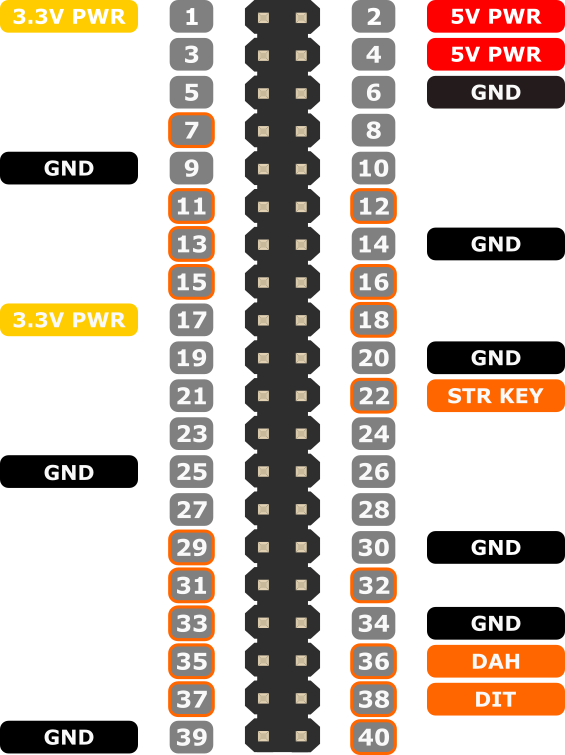

# pigCW

Still experimental. This is a terminal-only client to [Vail](https://vail.woozle.net), for practicing Morse code over the internet.
Connect a straight key or a paddle to the Pi's GPIo and a speaker on its audio output. It becomes a rather direct little Vail terminal - the moment someone sends something on Vail, you will hear it and you can reply directly from your key. It also generates the sidetone on the very same speaker, with care taken for a real-time response.
Based on an idea by [YO3AX](https://github.com/YO3AX): "I'm thinking of a batphone like device, but for CW, directly connected to Vail. It just beeps at you when someone sends and patiently waits for your reply"

The name pigCW is a bad pun between ham and pigpio - the main IO library - often misread as "pig pio".

But why Vail?

Vail suits this sort of thing unusually well because:
- it has near-instant sidetone. This matters once you start taking keying a bit more seriously
- it allows you to practice with friends without turning on your rig
- the community is excellent. I even got QSL cards for contacts made here
- it has open hardware, built around a cheap little $10 Seeed board
- the hardware is well made, and when operating as a MIDI device, it lets you do something else instead of keeping the app in focus
- this matters, because most similar tools, like VBand, are really just pretending to be USB HID keyboards - if you lose focus on the window, it stops working. In other words, you cannot just turn off the monitor and leave it in listen mode
- it's designed for QRQ modes too and it's actually conversational, well into the 20-24ms per dit sort of territory (this doesn't mean slow keying doesn't work)

Vail is bloody good for CW group practice sessions, because it sets up a low-latency link that still feels conversational while preserving the other operator's fist. If not, you can use [vail zoomer](https://github.com/Vail-CW/vail-zoomer) which injects audio directly into zoom.


## Installation

`apt-get install pigpio-tools python3-pigpio python3-numpy libportaudio2 portaudio19-dev python3-pip`

`python3 -m pip install --break-system-packages sounddevice`

You will need pigpiod for this. Once you have it installed, this should return 0

`pigs r 25	# read pin 25`

if it returns `socket connect failed` instead, pigpiod is not running.


Since pigpiod is no longer available under Trixie, run this to build it:
```
sudo apt install -y python3-setuptools python3-full
wget https://github.com/joan2937/pigpio/archive/refs/tags/v79.tar.gz
tar zxf v79.tar.gz
cd pigpio-79
make

sudo make install
sudo ldconfig
sudo systemctl daemon-reload
```

## Wiring

The following pins are used for I/O, and the headphone jack is used for audio.
- pin 22 (BCM GPIO 25): straight key input
- pin 38 (BCM GPIO20): paddle dit
- pin 36 (BCM GPIO16): paddle dah
- ~~pin 15 (BCM GPIO 22): buzzer, mixed rx/tx audio~~
- audio jack: Audio out: both the receiver and your sidetone



## Running 

Run as `python -m src.vail`.
